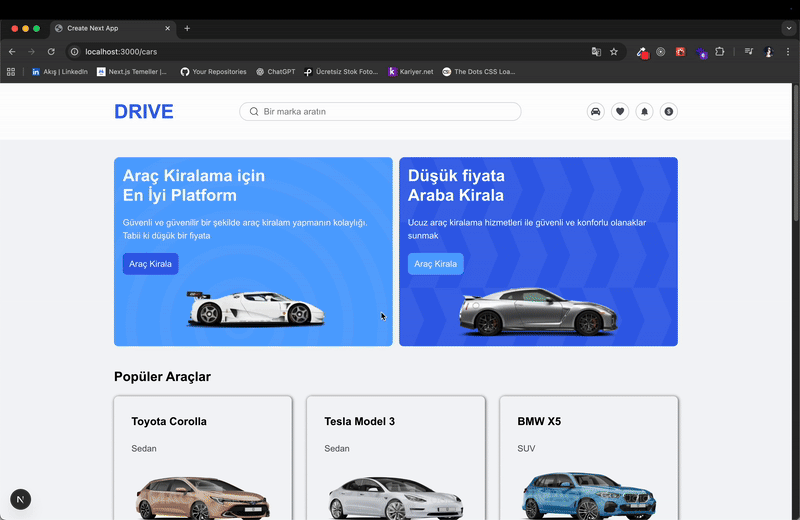

🚗 Car Rental App with Next.js & TypeScript

This project is a modern and user-friendly car rental application. Users can browse listed cars, view detailed pages for each vehicle, complete rentals via Stripe, and see their rented cars on the "My Orders" page.

🔗 Live Demo: (Add your live demo link here)
🔗 GitHub Repository: GitHub Repo

🚀 Features

✅ Car Listing:

All car models are displayed with basic information.

Users can visit a car’s detail page to see more information.

✅ Car Rental:

Users can rent selected cars securely via Stripe.

After payment, rental information is shown on the "My Orders" page.

✅ My Orders Page:

Displays all cars rented by the user.

Shows essential rental information for each car.

✅ Modern & Responsive Design:

Fully responsive UI built with TailwindCSS.

Enhanced visuals with React-icons.

🛠️ Technologies Used

Next.js

TypeScript

TailwindCSS

Stripe

Mongoose (MongoDB)

React-icons

